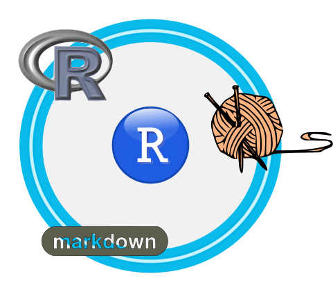

% Taller Caldum: Introducción: R + `knitr` + `markdown` 
% Antonio Murandi; José Antonio Palazón
% Murcia, 24 de julio de 2012



 

### Una cita 

My grandfather once told me there are two kinds of people:  

> Those who do the work and those who take the credit.
> He told me to try to be in the first group; there was much less competition."

–– Indira Gandhi, _the late Prime Minister of India_


# Objetivos y fundamentos

## Objetivos

### ¿Qué vamos a ver?
**Investigación reproducible**  

* Analizar el valor de los métodos asociados a la IR

* Conocer herramientas para el trabajo con IR

* Plantear métodos de trabajo en IR

* Establecer un punto de partida para el trabajo colaborativo

### ¿Por donde empezar?

* En la wikipedia
    * [markdown](http://es.wikipedia.org/wiki/Markdown "")
    * [R ](http://es.wikipedia.org/wiki/R_(lenguaje_de_programaci%C3%B3n) "")

* Página principal
    * _The Comprehensive R Archive Network_: [CRAN](http://cran.r-project.org/ "")
    * [`knitr`](http://yihui.name/knitr/ "")
    * [RStudio](http://rstudio.org/ "")
    * [markdown](http://daringfireball.net/projects/markdown/ "")
    * El programa para manejar textos en markdown: [pandoc](http://johnmacfarlane.net/pandoc/ "")

## De `nerds`, humanos y cultura

<!--Torre de Babel -->

### Condenados a no entendernos ...

* Documentos para seres humanos que hacen el papel de máquinas

* Escasa capacidad de abstraer datos y procedimientos

* Prisa, mucha, mucha prisa

* ~~Nula~~ Escasa formación tecnológica

* Lo que dice Vicente es lo que dice la gente

### ¿TIC o TI?

* **TIC**: Tecnología de la Información y de las Comunicaciones

* **TI**:  Tecnología de la Información 

* Comunicación: emisor --- medio --- receptor

### Trabajando racionalmente

* El código mínimo
    * Esclavos

    * Escribas

    * Conocimiento

    * Autómatas

* ¿Cuanto de si da un _bit_?

* _The Open University_ [tutorial para la escritura en la universidad](http://www.open.ac.uk/skillsforstudy/writing-for-university.php ""), y un artículo de [_American Scientist](http://www.americanscientist.org/issues/pub/the-science-of-scientific-writing/ "")

* [Cuidadín](http://abstrusegoose.com/474 "")


### Lenguajes

* Semántica: el significado de las cosas

* Semiótica: símbolos y conocimiento

* Sintaxis: reglas de comunicación

* El sufrido papel y las reglas universales o _yo me entiendo_

### Herramientas generales

* Terminales

* Editores

* Manejo de gráficos

* Hojas de cálculo

* ...

### Herramientas de autor

* R:           programa para el desarrollo de procedimientos de análisis de datos

* knitr:       librería de R

* markdown:    lenguaje de marcas

* **RStudio**: entorno de desarrollo para R


# RStudio

## Breve repaso a las características de Rstudio

### Ventajas de Rstudio

* Alternativas
    * `xterm`, `gnome-terminal`,  `terminator`, ...
    * gedit, block de notas, nano, ...
    * emacs, ...

* Ventajas
    * Manejo integrado
    * Información de los distintos elementos
    * Definición de proyectos
    * Creación de documentos: facilita la escritura de _scripts_
    * Completado inteligente de paréntesis
    * Oferta de opciones


## Creación de un proyecto

### Ejercicio

* Crear un proyecto llamado `Ejercicio1`
* Utilizar el siguiente código para crear
  un `Rscript`  
(`File-> New-> Rscript` o `CTL+SHIFT+n`)
  
```
# Sumar los diez primeros enteros
sum( 1:10 )
# Representar la función seno
( curve( sin, -pi, pi, col=3, lwd=4 ) )
abline( v=0, h=0, col="grey", lwd=2)
```

* Comprobar el código 
* Configurar las opciones (`Tools-> Options`)
* Guardar el proyecto y salir de RStudio


# Markdown  

## Aspectos básicos de markdown

### ¿Que puede hacer markdown por mi?

* Quiero olvidarme del instrumento para pensar sólo en lo que estoy escribiendo
* Quiero escribir sin preocuparme del aspecto
* Quiero reutilizar lo que ya sé
* Quiero índices, bibliografía, ...
* Quiero documentos ligeros
* Quiero escribir como me convenga, para el lector lo que necesite
* Quiero poder recortar y pegar a sin problemas
* Quiero trabajar con mis colegas

### Un lenguaje de marcas

* mediawiki, dokuwiki, ...
* rts, org, ...
* html, html5, xml, sgml, ...
* docbook
* LaTeX (beamer, ...)
* texinfo, textile, context
* epub, groff, asciidoc
* Ver este [video](http://youtu.be/u9UAo899bn8 "") para saber mas sobre lenguajes de marcas
* [Mapa](http://johnmacfarlane.net/pandoc/diagram.png "") de relaciones entre distintos formatos


### Conceptos básicos de la sintaxis

* Documentación [original del autor](http://daringfireball.net/projects/markdown/syntax ""),
[traducción al castellano](http://plataforma.asmoz.org/help.php?file=markdown.html "")

* Sintaxis con las extensiones de [pandoc](http://johnmacfarlane.net/pandoc/README.html)

* Un interesante texto para escribir con soltura en markdown documentos complejos

* Una _chuleta_ (_refcard_ o _cheatsheet_) [de markdown](http://scottboms.com/downloads/documentation/markdown_cheatsheet.pdf "")

* Otros [enlaces de interés](http://servbiob.inf.um.es/proyectos/public/projects/markdown-umu/wiki "")

* Podemos utilizar Rstudio como editor de markdown (incluye acceso directo a las ayudas)

### Elementos básicos

* La estructura del documento: encabezamientos (cabeceras de distinto nivel)
* Las fuentes imprescindibles (negritas, cursivas, tipo terminal, subíndices, ...)
* Bloques de texto
* Listas de concepto, numeradas o no
* Citas
* Enlaces
* Tablas y gráficos

### Uso adecuado de las fuentes
* _cursiva_:  
    * para palabras en otros idiomas (_ad_ _hoc_)
    * una acepción especial que va a definirse (_segmentación_)
    * para nombres de variables (_x_)
* `terminal`: 
    * literales para trasladar al sistema informático (`plot( x, y )`) 
    * para términos de TI (`pdf`, `shell`), en este caso debe usarse con cuidado

### Ejercicio

* Usando RStudio, desde el proyecto anterior, prepara un documento
  describiendo dos estadísticos habituales, aprovecha el siguiente
  código básico:

```
% Dos estadísticos básicos
% Autor
% Taller Caldum, 24 de julio de 2012

# De la media

# De la varianza

```

* Guarda el fichero: `estadisticos.md`

* Comprueba la salida en html


## Avanzando con markdown

### Fórmulas

* Se utiliza la notación de $\LaTeX$

* Para marcarlas utilizamos \$ delante y detrás de la fórmula

* Un ejemplo: `$\bar{x}$` que proporciona $\bar{x}$  

* Pero ...  
--- ... ¡¡¡ yo no sé nada de $\LaTeX$ !!!  
--- Entonces, simplemente, [dibuja las formulas](http://webdemo.visionobjects.com/equation.html?locale=es_ES)

### Ejercicio

* Incluye en el documento las formulas correspondientes a los estadísticos indicados

* Comprueba la salida en html

### Gráficos, enlaces, bibliografía ...

* Es posible utilizar una base de datos bibliográfica para citar los documentos desde el texto

* Se incluyen enlaces a referencias web o locales:   
`[texto de referencia](http://enlace "Texto a visualizar al pasar el mouse")`

* Se incluyen gráficos fácilmente:  
``


### Ejercicio 

Incluye en el documento:

* Enlaces a citas del uso de la media y la varianza

* Una figura correspondiente al tema de trabajo

¿Algún problema?


# Knitr

## Investigación reproducible con R

### Documentación del proyecto

* [CRAN](http://cran.r-project.org/ "")
    * [Task views](http://cran.r-project.org/web/packages/ "")
        * [Investigación Reproducible](http://cran.r-project.org/web/views/ReproducibleResearch.html "")

* [paquetes](http://cran.r-project.org/web/packages/ "")
    * [knitr](http://cran.r-project.org/web/packages/knitr/index.html "")

* [`Sweave`](http://www.statistik.lmu.de/~leisch/Sweave/ ""), desarrollado por F. Leisch
* [`knitr`]((http://yihui.name/knitr/ ""), desarrollado por Y. Xie

### Ventajas e inconvenientes de `knitr`

* Más sencillo de implementar
* Permite producir gráficos sin limitaciones
* Más opciones
* Permite usar otros lenguajes de programación  

\ 

* El autor, en su documentación, asume el conocimiento de `Sweave`


### Elementos en investigación reproducible

* **textos**  _vs_  **_chunks_**: marcas para inicio y fin de _chunk_

~~~~
# Ejemplo de IR

Esto es un ejemplo para ver la unión
de un texto y un _chunck_ en el documento
fuente:

```{r}
sum(1:10)
plot(1:10)
```

Cuando R procese este documento
se incluirá los resultados de la
suma y el gráfico indicado en el
_chunk_.
~~~~

### Proceso en investigación reproducible

1. Elaboración del documento donde se auna
   la escritura del código y los textos necesarios. 
   En `markdonw` y R la extensión del fichero es `.Rmd`

2. Procesado del documento por la aplicación correspondiente
   a lenguaje de trabajo, en nuestro caso R. Creación
   de un documento en el formato deseado; en nuetro caso
   un documento `.md`

3. Procesado, en su caso, del documento resultante, por ejemplo:
   elaboración de un documento  `.pdf`.


### Ejercicio

* Siguiendo con el ejemplo anterior añadir los _chunks_ necesarios
  para incluir un ejemplo de calculo en cada uno de los estadísticos
  anteriores

```
x <- c( 53, 56, 47, 30, 54, 2, 62, 25, 25, 53 )
mean(x)
var(x)

```

* Convertir el documento en `markdown` en `R markdown`, guardándolo con la extensión `.Rmd`

* Crear el _chunks_ de forma automática con el menú adecuado.


### Usando directamente la librería `knitr`

* En la terminal de R utilizaremos directamente:

        library(knitr)
        knitr("estadisticos.Rmd")

* ¿Cuál es el resultado? ¿Dónde se ubica el fichero `estadisticos.html` creado?


### _chunks_: opciones, valores en las frases 

* Valores en el texto, compruebe este código en el documento
  de trabajo.

        En este ejemplo se comprueba que el máximo 
        valor tomado por los datos es `r max(x)`,
        mientras el mínimo es
        `r min(x)`.

    * ¿Algún problema? 


### _chunks_: opciones, ocultando código

* Para ocultar código, no los resultados, comprobar las diferencias

        ```{r}
        mean(x)
        hist(x)
        ```

        ```{r echo=F}
        mean(x)
        hist(x)
        ```

### _chunks_: opciones 

* Todas las [opciones](http://yihui.name/knitr/options "") 

* `{r inicio}` define este _chunk_ con el nombre `inicio`

* `{r ,` opción 1`, ` opción 2 `, ... }` separamos las opciones por comas

* `eval=FALSE` el _chunk_ no es evaluado

* `results=hide` el _chunk_ es evaluado pero no se muestran los resultados

### _chunks_: opciones 
* `prompt=FALSE` elimina en la salida el prompt de las expresiones 

* `comment=NA` elimina en la salida los caracteres `##`  que anteceden a las líneas de resultados

* `background=#F7F7F7'` para determinar el color de fondo de los _chunks_

* `tidy=TRUE` presenta el código de forma elegante


### _chunks_: opciones

* `fig.keep='last'` en el _chunk_ sólo se conserva la última gráfica generada
* `dpi=72` resolución para las gráficas generadas en el _chunk_
* `fig.width=9` ancho de las figuras en pulgadas (también `fig.height`)
* `dev='Cairo_svg'` define el formato gráfico de salida para las figuras del _chunk_

\  

* `cache=TRUE` se activa la cache para el _chunk_ 


### Pero yo, yo amo el zarzal

* En la terminal podemos ejecutar para obtener el documento final:

        Rscript -e "library(knitr); \
        knit('estadisticos.Rmd')"

* posteriormente, con `pandoc` obtenemos el formato deseado

* Transparencias

        pandoc -s -S -i -t dzslides  \
                -m estadisticos.md   \
                -o estadisticos.html


### Pero yo, amo el zarzal

* Documento en $\LaTeX$

        pandoc -s -S -i  --toc estadisticos.md \
               -o estadisticos.tex
        
        pdflatex estadisticos.tex

* En formato de procesador:

        pandoc -s -S -i -m --toc estadisticos.md \
               -o estadisticos.odt

* ¿Algún problema?  ¿cómo hacemos un fichero para un libro electrónico?


### Extrayendo el código de todos lo _chunks_

* En ocasiones queremos extraer el código de R
* Ejemplo: 
`purl("estadisticos.Rnw")

* Proporciona un fichero `estadisticos.R`

* Cada _chunk_ está etiquetado y puede ser llamado
  desde otro documento con esa etiqueta

### Organizando el proyecto

```
─── proyectoX
    ├── dat
    ├── img
    ├── doc
    ├── html
    │
    ├── Leeme
    ├── informe.Rmd   informe.md
    │
    ├── bibliografia.bib
    │
    └── .Rhistory .RData
```

### Organizando el proyecto

```
─── proyectoX
    ├── dat
    │   ├── datos.csv
    │   └── variables.csv
    ├── img
    │   ├── imagen1.png   imagen3.png   
    │   └── dibujo1.svg   dibujo4.pdf  ...  
    ├── doc
    │   ├── informe.doc
    │   └── plantilla.doc
    ├── html
    │   ├── estilo.css
    │   └── informe.html
    │
    └── .. 
```

### Para un adecuado seguimiento del trabajo

Al final o el inicio, según preferencias, conviene
añadir:

`print(sessionInfo(), locale = FALSE)`

```
R version 2.15.1 (2012-06-22)
Platform: x86_64-pc-linux-gnu (64-bit)

attached base packages:
[1] stats     graphics  grDevices utils     
[4] datasets  methods   base     

other attached packages:
[1] knitr_0.7

loaded via a namespace (and not attached):
[1] digest_0.5.2   evaluate_0.4.1 formatR_0.4    
[4] markdown_0.5.2 parser_0.0-14  plyr_1.7.1     Rcpp_0.9.10   
[8] stringr_0.6    tools_2.15.1  
```


# Algunas referencias

### Documentación sobre `knitr`

* [Manual de `knitr`](https://github.com/downloads/yihui/knitr/knitr-manual.pdf)

* [Blog de los erreros](http://erre-que-erre-paco.blogspot.com.es/2012/05/knitr-un-paquete-avanzado-para-la.html)

* [Preparando transparencias con `markdown` [`.Rmd`](http://yihui.name/en/2012/05/how-to-make-html5-slides-with-knitr/), [`html`](http://yihui.name/slides/knitr-slides.html#1.0)

* [Grupo usuarios de google: knitr](http://groups.google.com/group/knitr)


