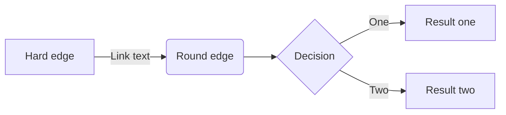

# Mi primer documento Markdown
Este documento es para experimentar lo que es diagramar con texto *Markup*.
Vamos ahora a realizar varios ensayos.
* Insertaremos una imagen

* insertaremos una ecuación
$\intop_{1}^{2}x^{2}dx$

* * *
* Imagenes 

* Insertar una imagen con el tamaño personalizado
- - -
<center></center>
***
![][id]
[id]: http://bit.ly/1g1oUFW "title" "width:200px;height:100px"


- - -


* Insertaremos líneas de código en Python
```python
       def syntaxHighlight():
    haroo = "press"
    return haroo
```

* Insertan código LaTex

```tex
\documentclass[12pt]{article}
\usepackage{lingmacros}
\usepackage{tree-dvips}
\begin{document} 
```

* Código en php

```php
<?php
$a1=array("a"=>"red","b"=>"green","c"=>"blue");
$a2=array("a"=>"red","c"=>"blue","d"=>"pink");

$result=array_intersect_key($a1,$a2);
print_r($result);
?>
```

* * *

```ruby
code block
```

~~~cpp
fenced code block
~~~

~~~javascript
function syntaxHighlight(code, lang) {
   var foo = 'rhio';
   var bar = 33;
}
~~~
* Tablas
| Column | Column | Column |
|--------|--------|--------|
| value  | value  | value  |

* Insertar media rich
@[media](https://twitter.com/haroopad/status/337257711827841024)
@[caption](https://twitter.com/haroopad/status/337257711827841024 'width:200px;margin:1em')
* Audio y video


* Otros
- [x] send email
- [ ] meet with my boss
- [ ] date with my girl friend
- [ ] write techical reporting about javascript

* * *


```markdown
graph TD;
    A-->B;
    A-->C;
    B-->D;
    C-->D;
```




